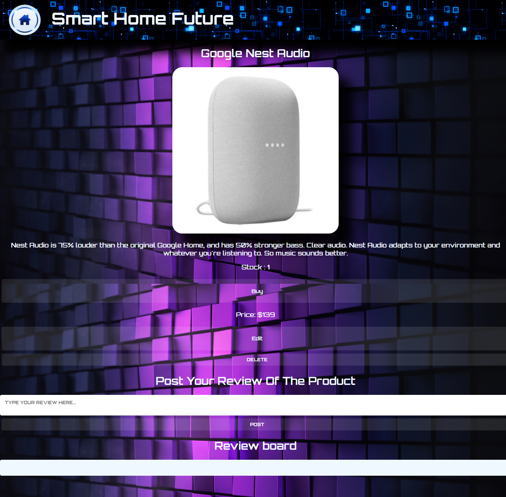

# smart_home

## Link
https://smart-home-app.herokuapp.com/smart_home

## Database/Storage
- #### MongoDB
- #### Heroku

## Technologies
- #### EJS
- #### Method-override
- #### Bycript
- #### Express-session
- #### Express
- #### Mongoose
- #### Nodemon
- #### Body-Parser
- #### Dotevn

## RESTful router

| **No.** | **Route** | **URL**       |**HTTP Verb**|   **Description**                                     |
|---------|-----------|---------------|-------------|-------------------------------------------------------|
| 1.      | Index     | /smart_home   | GET         | Signup or Login page                                  |
|         |           | /home         | GET         | Home page                                             |
| 2.      | New       | /users/new    | GET         | Signup form                                           |
|         |           | /sessions/new | GET         | Login form                                            |
|         |           | /home/new     | GET         | Create new products form                              |
| 3.      | Create    | /users/new    | POST        | Create new user into Database                         |
|         |           | /sessions/new | POST        | Authenticates user from Database                      |
|         |           | /home/new     | POST        | Add new products into Database                        |
| 4.      | Show      | /home/_id     | GET         | show base on product id of information                |
| 5.      | Edit      | /home/_id     | GET         | To edit existing products list                        |
| 6.      | Update    | /home/_id     | PUT         | Update requested products details                     |
|         |           | /home/buy     | PUT         | To buy the product and deducted from the stock        |
| 7.      | Destroy   | /logout       | DELETE      | Destroys sessions and redirect to starter page        |
|         |           | /home/_id     | DELETE      | Destroy requested product and redirected to home page |

## Accomplishments
- new user have to signup for new user name and password, after signup the user able login to the home page. the home page user able to create new product such as products name, image, description, price, quantity. user also can buy the products until the product quantity show "out of stock". user able to edit the product name, image, description, price or quantity. if the product is no longer in stock user can delete the product from the database list. user can click on the home icon to back to the home page.

## Wireframe Design
#### Main Page

- Signup or Login Page

- New User Signup Page

- User Login Page

- User Welcome Page

#### Home Page

- Home page for the smart home products page

- Create new product Page

- Show the product information page

- Show Out Of Stock in quantity

- Edit product Page

- Delete button 

## Additional Features were under Considerations

- create the consumer and seller profile
- create the consumer shopping cart
- seller rating
- create each product like by consumers
